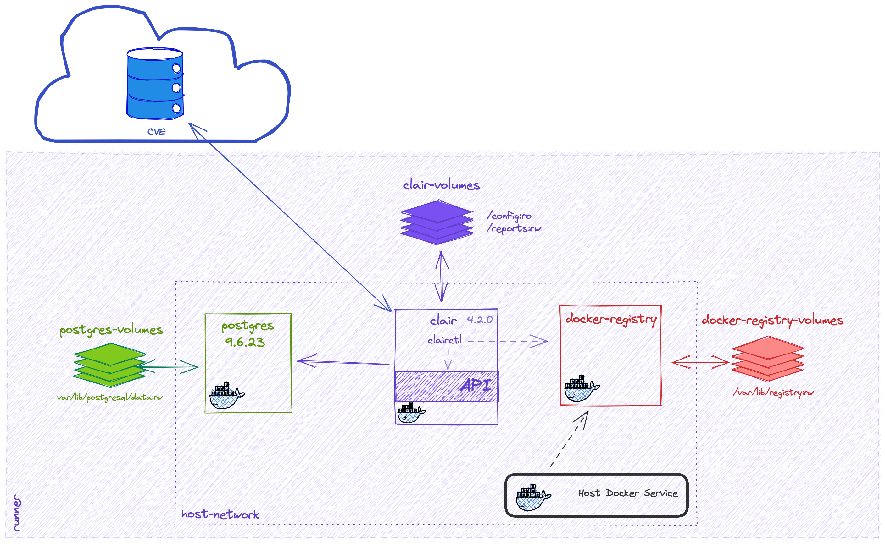

# Clair Scan Action

This action executes clair scanning by using the official clair Docker image and
restricted only to a given `updater`

## Inputs

## `image`

**Required**: Container image to analyze.

E.g.: vulnerables/web-dvwa

## `local`

**Optional**: It tells the action if it should perform the container image pull
or not. Values: yes | no

**Default value**: `yes'

## `report_format`

**Optional**: Report format. Values: xml | json | text

**Default value**: `json`

E.g.: `json`

## `report_path`

**Required**: Path to save the report

E.g.: `clairReport.json`

## `updater`

**Required**: The updater name for scanning as specified in the
[Clair config documentation](https://github.com/quay/clair/blob/main/Documentation/reference/config.md#updaterssets)

E.g.: `debian`

## Example usage

    - name: Clair Scan
      uses: santander-group/clair-scan-action@main
      with:
        image: vulnerables/web-dvwa
        local: no
        report_format: json
        report_path: clair-report.json
        updater: debian

## How it works

This action creates a virtual environment based on Docker containers to execute
the Clair scan of a given image. In the next picture, you can see the pieces
involved:

First, the action creates the volumes needed by the containers and start them.
The database used by Clair is populated with vulnerabilities for the given
technology in the `updater` input parameter. Then, the action uploads the image
indicated in the `image` parameter (it doesn't matter if it is local or not) to
the local Docker Registry. The action call the Clair client inside the Clair
container to run the image scan and store the result in the `report_path`
location, with the format specified by the `report_format` parameter.

## Getting involved

This project is far from being perfect, so any help is always welcome. Please,
review our [CONTRIBUTING](CONTRIBUTING.md) file to know how to get involved.

---

## Licensing info

* [LICENSE](LICENSE)

---

## Credits and references

1. [Clair](https://github.com/quay/clair)
2. [Creating actions official documentation](https://docs.github.com/en/actions/creating-actions)
